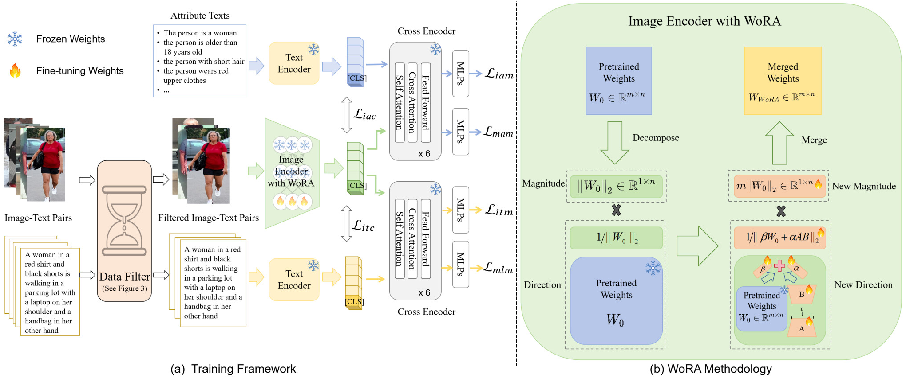

# From Data Deluge to Data Curation: A Filtering-WoRA Paradigm for Efficient Text-based Person Search 🕵️‍♂️

[](https://arxiv.org/abs/2404.10292)

---

## 💡 Introduction

The **Filtering-WoRA** paradigm focuses on efficient **text-based person search** by addressing the challenges of **data deluge** and **data curation**. 

**Authors:**
> [Jintao Sun](https://scholar.google.com/citations?hl=zh-CN&user=OhD3pk8AAAAJ), [Hao Fei](https://scholar.google.com/citations?user=YGDX46AAAAAJ), Gangyi Ding, [Zhedong Zheng](https://scholar.google.com/citations?user=XT17oUEAAAAJ)$\dagger$

$\dagger$ Corresponding authors

You can read the full paper [here](https://arxiv.org/abs/2404.10292).


---

## 🔥 News

- 2025.02.27: 🐣 Source code of [**Filtering-WoRA**]([https://arxiv.org/abs/2411.11919](https://github.com/JT-Sun/Filtering-WoRA)) is released!

## 🚀 Getting Started

Start by setting up the **Filtering-WoRA** repository on your local machine. Here's how:

### Prerequisites
Before installing, ensure you have the following dependencies:
- Python 3.x
- PyTorch
- Other dependencies listed in `requirements.txt`

---

## 🛠️ Installation

Clone the repository to your local machine:

```bash
git clone https://github.com/username/Filtering-WoRA.git
cd Filtering-WoRA
```

### Install Requirements

we use 8 A100 80G GPU for training and evaluation.

Create conda environment.

```
conda create -n wora python=3.8
conda activate wora
pip install torch==1.9.1+cu111 torchvision==0.10.1+cu111 torchaudio==0.9.1 -f https://download.pytorch.org/whl/torch_stable.html
pip install -r requirements.txt
```

### Dataset Preparation

Download the MALS dataset is released at [Baidu Yun](https://pan.baidu.com/s/1HMvNIIFlquI2w0R6f0G7Dg) [4kq0] and [OneDrive](https://1drv.ms/f/s!Ak2z-VJ5LcCvgdZGSTJbaHOMMFZi9A?e=gCBnv0) [mals].

Download the CUHK-PEDES dataset from [here](https://github.com/ShuangLI59/Person-Search-with-Natural-Language-Description) , the PA-100K dataset from [here](https://github.com/xh-liu/HydraPlus-Net), the RSTPReid dataset from [here](https://github.com/NjtechCVLab/RSTPReid-Dataset), and ICFG-PEDES dataset from [here](https://github.com/zifyloo/SSAN). Download the processed json files of the aboves four datasets from [here](https://pan.baidu.com/s/1oAkenOKaVEYWpNh2hznkGA) [b2l8]

Download pre-trained models for parameter initialization:

image encoder: [swin-transformer-base](https://github.com/SwinTransformer/storage/releases/download/v1.0.0/swin_base_patch4_window7_224_22k.pth)

text encoder: [bert-base](https://huggingface.co/bert-base-uncased/tree/main)

Organize `data` folder as follows:

```
|-- data/
|    |-- bert-base-uncased/
|    |-- finetune/
|        |-- gene_attrs/
|            |-- g_4x_attrs.json
|            |-- g_c_g_a_0_attrs.json
|            |-- ...
|        |-- cuhk_train.json
|        |-- ...
|        |-- icfg_train.json
|        |-- ...
|        |-- rstp_train.json
|        |-- ...
|        |-- PA100K_train.json
|        |-- ...
|    |-- swin_base_patch4_window7_224_22k.pth
```

And organize those datasets in `images` folder as follows:

```
|-- images/
|    |-- <CUHK-PEDES>/
|        |-- imgs/
|            |-- cam_a/
|            |-- cam_b/
|            |-- ...
|            |-- train_query/
|            |-- gene_crop/
|                |-- 4x/
|                |-- c_g_a/
|                |-- ...
|                |-- i_g_a_43/
|
|    |-- <ICFG-PEDES>/
|        |-- test/
|        |-- train/
|
|    |-- <pa100k>/
|        |-- release_data/
|
|    |-- <RSTPReid>/
```

### 📊 Data Filtering Process

#### 🧹 **Data Filtering for Pretrain**

1. **Step 1**: Find the data below the threshold (Example: `MALS-4x`)
    ```bash
    python read_cuhk_4x_top50.py
    ```

2. **Step 2**: Delete the filtered data (Example: `MALS-4x`)
    ```bash
    python top_filterdelet_single.py
    ```

    **Note**: Remember to modify the paths in the above Python files to your own. Also, change `4x` to the appropriate data folder name as needed.

3. **Batch Processing for MALS Datasets**:
    If you're processing multiple MALS datasets, use the following:
    ```bash
    python read_cuhk_part_cga_top50.py
    python top_filterdelet_parts.py
    ```

---

#### 🧹 **Data Filtering for Fine-tuning**

1. **Step 1**: Find the data below the threshold (Example: `CUHK-PEDES`)
    ```bash
    python cuhk_filter_ft90.py
    ```

2. **Step 2**: Delete the filtered data (Example: `CUHK-PEDES`)
    ```bash
    python cuhk_fintune_filterdelet_json.py
    ```

    **Note**: Remember to modify the paths in the above Python files to your own.

---

### 🏋️‍♂️Pretraining
To pretrain **Filtering-WoRA** using MALS, run the following command:

```
python run.py --task "itr_gene" --dist "f8" --output_dir "output/pretrained"
```

### 🔄Fine-tuning
We fine-tune our **Filtering-WoRA** using existing text-based Person Re-id datasets. Performance can be improved by replacing the backbone with our pre-trained model. Taking CUHK-PEDES as an example:

```
python run.py --task "itr_cuhk" --dist "f8" --output_dir "output/ft_cuhk" --checkpoint "output/pretrained/checkpoint_31.pth"
```

### 📝Evaluation

```
python run.py --task "itr_cuhk" --evaluate --dist "f8" --output_dir "output/ft_cuhk/test" --checkpoint "output/ft_cuhk/checkpoint_best.pth"
```

## 📚 Citation

If you use **Filtering-WoRA** in your research, please cite the following BibTeX entry:

```bibtex
@inproceedings{10.1145/3696410.3714788,
author = {Sun, Jintao and Fei, Hao and Ding, Gangyi and Zheng, Zhedong},
title = {From Data Deluge to Data Curation: A Filtering-WoRA Paradigm for Efficient Text-based Person Search},
year = {2025},
isbn = {9798400712746},
publisher = {Association for Computing Machinery},
address = {New York, NY, USA},
url = {https://doi.org/10.1145/3696410.3714788},
doi = {10.1145/3696410.3714788},
abstract = {In text-based person search endeavors, data generation has emerged as a prevailing practice, addressing concerns over privacy preservation and the arduous task of manual annotation. Although the number of synthesized data can be infinite in theory, the scientific conundrum persists that how much generated data optimally fuels subsequent model training. We observe that only a subset of the data in these constructed datasets plays a decisive role. Therefore, we introduce a new Filtering-WoRA paradigm, which contains a filtering algorithm to identify this crucial data subset and WoRA (Weighted Low-Rank Adaptation) learning strategy for light fine-tuning. The filtering algorithm is based on the cross-modality relevance to remove the lots of coarse matching synthesis pairs. As the number of data decreases, we do not need to fine-tune the entire model. Therefore, we propose a WoRA learning strategy to efficiently update a minimal portion of model parameters. WoRA streamlines the learning process, enabling heightened efficiency in extracting knowledge from fewer, yet potent, data instances. Extensive experimentation validates the efficacy of pretraining, where our model achieves advanced and efficient retrieval performance on challenging real-world benchmarks. Notably, on the CUHK-PEDES dataset, we have achieved a competitive mAP of 67.02\% while reducing model training time by 19.82\%.},
booktitle = {Proceedings of the ACM on Web Conference 2025},
pages = {2341–2351},
numpages = {11},
keywords = {data-centric learning, low-rank adaptation, text-based person search, visual-language pre-training},
location = {Sydney NSW, Australia},
series = {WWW '25}
}
```
## ✨ Acknowledgement
- Our code is based on [APTM](https://github.com/Shuyu-XJTU/APTM/tree/main)
- [BLIP](https://github.com/salesforce/BLIP), [BLIP-2](https://github.com/salesforce/LAVIS): Thanks a lot for the foundamental efforts!
